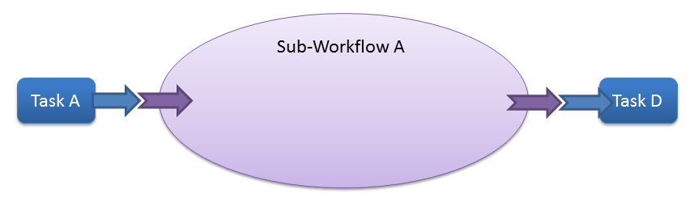
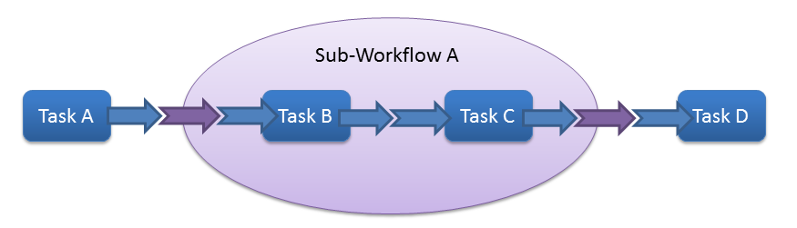

Sub-Workflows
==============

.. _sub_workflow_overview:

Overview
--------

A sub-workflow is like a mini :doc:`Workflow <workflows>` that you can use as a component of a larger workflow, as you
would a :doc:`Task <tasks>`.  The main difference between sub-workflows and workflows is that a sub-workflow can have
inputs and outputs, just like a task.  Sub-workflows can therefore "package" several tasks together in a reusable
mini-workflow that can then be injected into any workflow.

The image below shows the concept of a sub-workflow from the perspective of the workflow.  In essence, it behaves just
like a task.  It's a piece of a larger pipeline that has inputs that are fed to it be Task A and outputs which are fed
to Task D.

However, the sub-workflow really consists of multiple tasks, as shown in the next image.  The sub-workflow is a
mini-workflow where Task B passes its output into the input of Task C.  It gets a little tricky because there is the
need to differentiate between sub-workflow inputs/outputs and task inputs/outputs.  The sub-workflow inputs and outputs
are indicated with the purple arrows, while the task inputs and outputs are indicated with the dark blue arrows.  Task
B requires an input, and it gets that input from the input of the sub-workflow as a whole.  Similarly, Task C produces
an output, which it passes on to the output of the sub-workflow as a whole.  It is this process of connecting the
inputs and outputs of the tasks within a sub-workflow to the inputs and outputs of the sub-workflow itself that allows
the parent workflow to treat the sub-workflow as an individual task.

Declaring a Sub-Workflow
---------------------

The first step is to declare your sub-workflow class.  A sub-workflow should inherit from the
:class:`~sciluigi.subworkflow.SubWorkflowTask` class.  Like a regular :doc:`SciLuigi task <tasks>`, a workflow can
accept Luigi parameters.

Code:

.. code-block:: python

    import luigi
    from sciluigi import SubWorkflowTask

    class MySubWorkflow(SubWorkflowTask):

        my_param = luigi.Parameter()
        my_other_param = luigi.Parameter()

        # Rest of sub-workflow code goes here

Initializing Tasks
------------------

The first step is to initialize all of the tasks that will make up your sub-workflow.  To do this, you'll need to
implement the :meth:`~sciluigi.subworkflow.SubWorkflowTask.initialize_tasks` method.  Within this method, you simply
declare tasks in the :doc:`same way as you do within a Workflow's workflow method <workflows>`.  See example below.

.. code-block:: python

    def initialize_tasks(self):
        self.my_first_task = self.new_task('My Task Name', MyTask, task_param='foo', another_task_param='bar')
        self.my_second_task = self.new_task('My Other Task Name', MyOtherTask, yet_another_task_param='baz')
        self.my_third_task = self.new_task('My Third Task Name', MyThirdTask)

Declaring Inputs and Outputs
-----------------------------

Once your tasks have been initialized, you need to declare your inputs and outputs.  You must do this within an
:meth:`~sciluigi.subworkflow.SubWorkflowTask.initialize_inputs_and_outputs` method.  The format for this declaration is
:ref:`nearly the same as for the input/output declaration of a task <task_inputs_outputs>`.  The big difference is
that, instead of assigning a :class:`~sciluigi.dependencies.TargetInfo` or an
:class:`~sciluigi.dependencies.S3TargetInfo` to the outputs, you assign a
:class:`~sciluigi.dependencies.SubWorkflowOutput`.  You must do this because the outputs of a sub-workflow will
actually be outputs of one or more tasks within the sub-workflow (see the example in the
:ref:`overview <sub_workflow_overview>` where the sub-workflow output was actually connected to the output of Task C).
**As with tasks, all input names must begin with** ``in_`` **and all output names must begin with** ``out_``.  See the
example below.

.. code-block:: python

    from sciluigi import TaskInput
    from sciluigi import SubWorkflowOutput

    def initialize_inputs_and_outputs(self):
        self.in_my_input = TaskInput()

        self.out_my_output = SubWorkflowOutput(self)

Connecting Tasks, Inputs, and Outputs
--------------------------------------

Using a Sub-Workflow
----------------------
